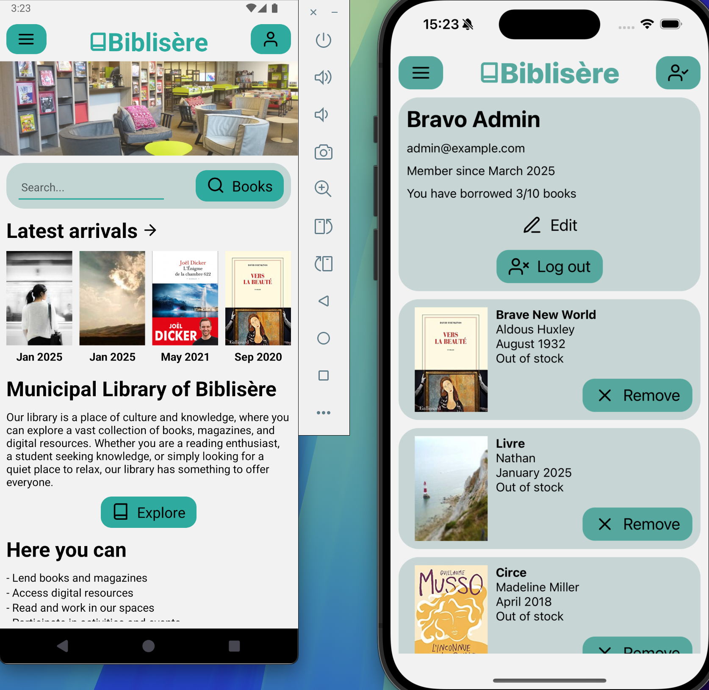

# Plongeoir React Native  Version 0.1.0
By [Nathan Choukroun](https://github.com/ntacv)


## 

## Visuals



## Description

**Training project for React Native.**
This project is a virtual library application that let visitors get information and users list their borrowed books. The admin page manages access users and books.

## Getting started

```
yarn && yarn start 
```
- update baseurl.ts 
- connect to your device with expo app


## Roadmap

- [x] Main page for information
- [x] Catalogue page and book details
- [x] User page and books list
- [x] Admin page and fonctionalities

